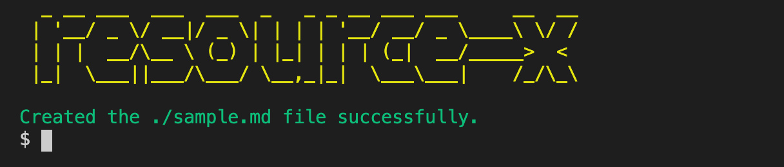
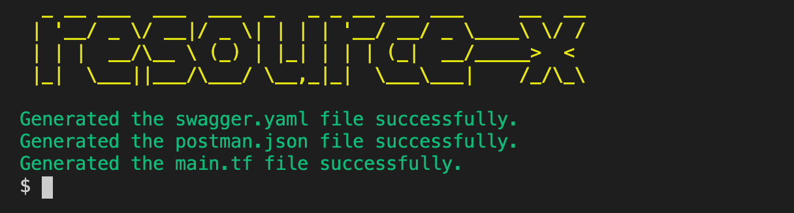
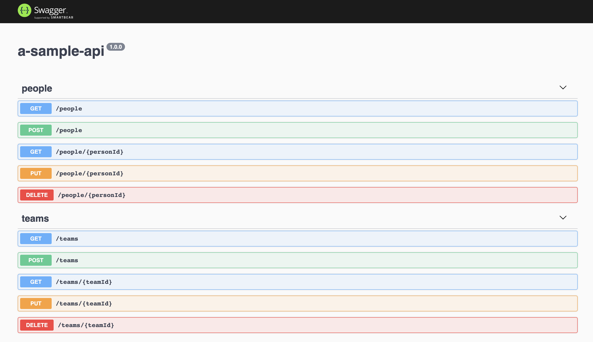
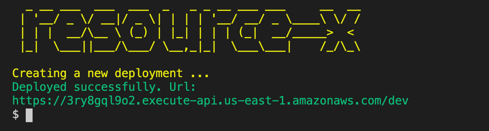
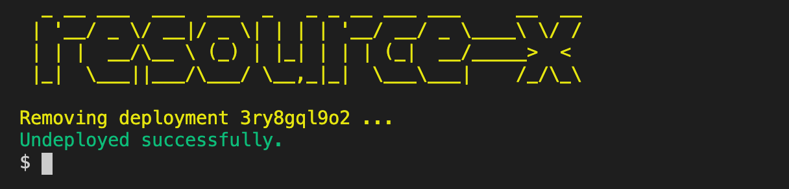
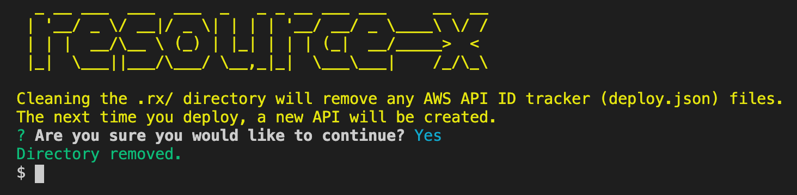
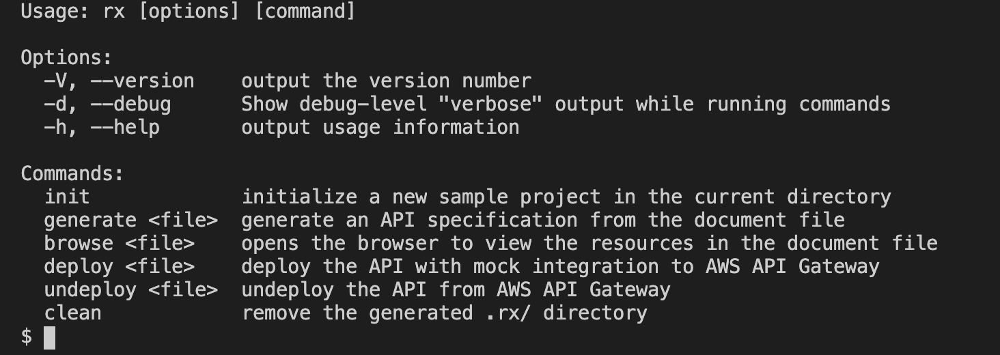

# resource-x

Resource and domain modeling for quick APIs, CMSs, and applications.


## Quick start

Deploy an API to the cloud **in under 30 seconds**, *in just 3 steps*.

```sh
rx init
rx generate sample.md
rx deploy sample.md
```

Interested? Check out the easy [installation](#installation) instructions.

## Tutorial


1) Build your domain objects as JSON Schemas, all in the same Markdown document. Alternatively, run `rx init` to get a [ready-to-use document](./sample.md) with two sample schemas.
   
2) When you run `rx generate sample.md`, you'll get a full CRUD (create-read-update-delete) Swagger specification for your API.

3) You can then deploy your specification to AWS API Gateway, complete with request validation and mock responses, with a single `rx deploy sample.md` command.

How easy was that?

## Features

- Domain modeling with simple schema objects
- Markdown support for easy writing, easy sharing, and good documentation
- Generate a full CRUD Swagger REST API with a single command
- Deploy a fully mocked API to AWS API gateway with a single command
- Request validation based on your schema objects
- Generates useful files that you can use with other tools, like `terraform` and `postman`
- CLI application works on Windows, Mac, and Linux, and everywhere node is supported
- Open source + free forever, with excellent support

## Installation

Installing is easy with [npm](https://www.npmjs.com/package/@khalidx/resource-x).

```sh
npm install -g @khalidx/resource-x
```

Alternatively, you can also [download a binary](https://github.com/khalidx/resource-x/releases/latest) for your operating system.

Windows, Mac, and Linux are all supported.

## Usage

Initialize a new sample project in the current directory.

```sh
rx init
```



Generate an API specification from the document file.

```sh
rx generate <file>
```



Opens the browser to view the resources in the document file.

```sh
rx browse <file>
```



Deploy the API with mock integration to AWS API Gateway.

```sh
rx deploy <file>
```



Undeploy the API from AWS API Gateway.

```sh
rx undeploy <file>
```



Remove the generated .rx/ directory.

```sh
rx clean
```



See help and usage information about all available commands.

```sh
rx --help
```



## Pro tips and tricks

- Commit the `.rx/**/deploy.json` files. These track your AWS API Gateway deployments, so that you don't end up creating a new API every time you check out from git and deploy.

- If you've already deployed your API, then later decide to rename it (by changing the heading in the Markdown document), make sure you also rename the corresponding `.rx/` directory for the API. This will ensure that you deploy an update to the same API rather than creating a new one.

- Make sure you only use AWS API Gateway compatible schema definitions. AWS does not support the full Swagger definition language. [Read more](https://docs.aws.amazon.com/apigateway/latest/developerguide/api-gateway-known-issues.html#api-gateway-known-issues-rest-apis) about what is supported (and what isn't) in the AWS documentation.

- You may want to do more advanced things with your API that this tool does not support. You can still use the tool to get started and generate a Swagger definition, then modify your definition by hand or with other tools before uploading to AWS manually. This will still save you some time, since writing the initial Swagger with all operations and AWS support is very time consuming.

- The module generates a `main.tf` file for your Swagger specification. This lets you import and continue your workflow in terraform!

## Support

Open a GitHub issue to ask a question, report a bug, raise a concern, or request a new feature.

Also, your question may already be answered on the following [Hacker News thread](https://news.ycombinator.com/item?id=20322759).
